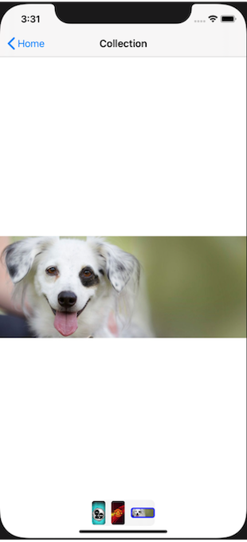

# GNImageCollection

 <a href="https://developer.apple.com/swift"></a> <a href="https://github.com/nicolaouG/GNImageCollection/blob/master/LICENSE"></a>

Shows image(s) with zooming, saving and sharing capabilities

 


## Getting started
```
platform :ios, '10.0'

pod 'GNImageCollection'
```

## How to use

You can have a look at the demo project for a simple use case.

```swift
// let images: [UIImage]
let imagesCollection = GNImageCollection(images: images, bottomImageTracker: .dots) // .thumbnails or .none
navigationController?.pushViewController(imagesCollection, animated: true)

// or
// present(imagesCollection, animated: true, completion: nil)

// or just get the collectionView to add it as a subview anywhere
// let cv = imagesCollection.getCollectionView(self)
```


```swift
// you can initialize the collection with images from url as well
let urlStrings = ["https://picsum.photos/id/238/400/300", "https://picsum.photos/id/237/350/600", "https://picsum.photos/seed/picsum/500/300"]
let imagesCollection = GNImageCollection(urlStrings: urlStrings, imagePlaceholder: #imageLiteral(resourceName: "placeholder"), bottomImageTracker: .thumbnails)
```


Or if you want to use kingfisher:

```swift
var images: [UIImage] = Array.init(repeating: #imageLiteral(resourceName: "placeholder"), count: urlStrings.count)

// update each row as soon as its image is downloaded
// bottomTrackerCollectionView needs updating only when .thumbnails is used

setImagesWithKingfisher(imagesCollection, urlStrings, nil, { (index, image) in
    guard index < imagesCollection.images?.count ?? 0,
		index < imagesCollection.bottomTrackerCollectionView.numberOfItems(inSection: 0),
        index < imagesCollection.collectionView.numberOfItems(inSection: 0)
        else { return }

	imagesCollection.images?[index] = image
	let trackerCell = imagesCollection.bottomTrackerCollectionView.cellForItem(at: IndexPath(item: index, section: 0)) as? GNTrackerCollectionViewCell
	let mainCell = imagesCollection.collectionView.cellForItem(at: IndexPath(item: index, section: 0)) as? GNImageCollectionViewCell

    if trackerCell?.imageView.image != nil {
        imagesCollection.bottomTrackerCollectionView.reloadItems(at: [IndexPath(item: index, section: 0)])
    }
    if mainCell?.image != nil {
        imagesCollection.collectionView.reloadItems(at: [IndexPath(item: index, section: 0)])
    }
}, nil)


// or reload once all of them are downloaded

setImagesWithKingfisher(imagesCollection, urlStrings, images) { (downloadedImages) in
	imagesCollection.images = downloadedImages
	imagesCollection.bottomTrackerCollectionView.reloadData()
	imagesCollection.collectionView.reloadData()
}


/* 
	Helper function
*/

func setImagesWithKingfisher(_ imagesCollection: GNImageCollection, _ links: [String], _ images: [UIImage]? = nil, _ onDownloadImage: ((_ index: Int, _ image: UIImage) -> Void)? = nil, _ completion: ((_ downloadedImages: [UIImage]) -> Void)? = nil) {
    var images = images ?? []
    var total = 0
    for (i, link) in links.enumerated() {
        guard let url = URL(string: link) else {
            total += 1
            if total == links.count {
                completion?(images)
            }
            continue
        }
        KingfisherManager.shared.retrieveImage(with: url) { result in
            total += 1
            switch result {
            case .success(let value):
                if images.count > i {
                    images[i] = value.image
                }
                onDownloadImage?(i, value.image)
            case .failure(_):
                break
            }
            if total == links.count {
                completion?(images)
            }
        }
    }
}

```
